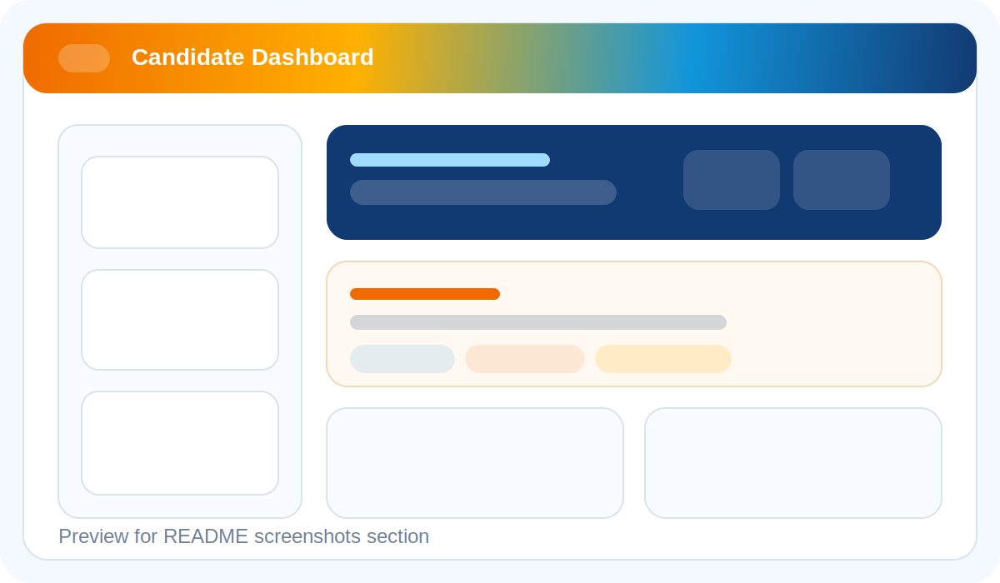
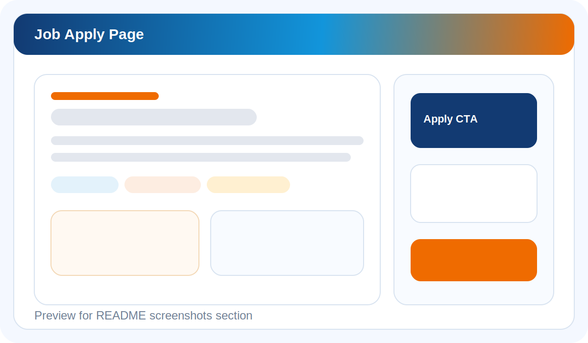
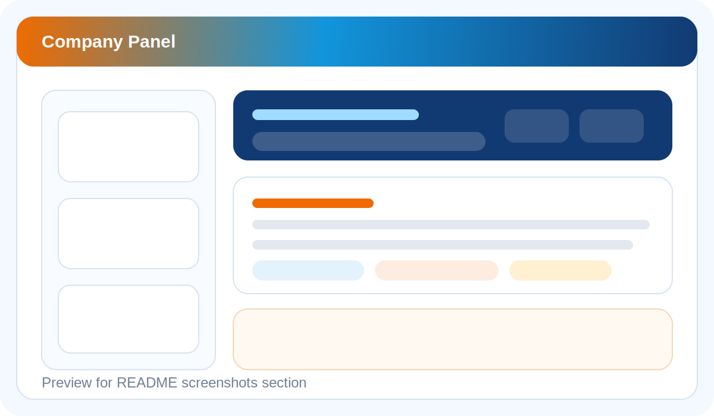

# FresherConnect Overview

FresherConnect ek full-stack job portal aur hiring platform hai jo fresh graduates, recruiters, aur platform admins ko ek hi system me connect karta hai.
Iska main goal hai fresher hiring ko zyada structured, professional, aur transparent banana, taaki:

- candidates verified jobs dhoondh sakein
- companies faster hiring kar sakein
- admin platform quality maintain kar sake

FresherConnect ab React + Next.js frontend, Redux Toolkit state management, aur Python Flask backend ke saath modern production-style architecture par chal raha hai.

## User Roles

Platform me 3 main roles hain:

- `Fresher / Candidate`
- `Company / Recruiter`
- `Admin`

Har role ka apna dedicated workflow, dashboard, aur permissions model hai.

## Product Photos

### 1. Candidate Dashboard

Ye screen candidate ko profile, applications, notifications, recommended jobs, aur saved opportunities ek jagah dikhati hai.

### 2. Job Apply Flow

Ye screen role details, company details, skills, hiring stages, aur application action ko clear format me show karti hai.

### 3. Company Panel

Ye screen recruiter/company ko job posting, candidate pipeline, analytics, logo management, aur recent hiring activity manage karne me help karti hai.

## FresherConnect Ke All Main Features

### 1. Shared Platform Features

- React based modern frontend with reusable components
- Next.js App Router based route structure
- Redux Toolkit based centralized state management
- TypeScript validation for safer frontend development
- Professional SaaS-style UI with responsive layout
- Shared sticky header and navigation shell
- Live Updates ticker header ke neeche jo latest companies aur latest jobs ko auto-scroll karta hai
- Hover par pause hone wala seamless infinite marquee
- Public reviews / testimonials section
- Dynamic API-based frontend data loading using `fetch` / shared API helpers
- Mobile responsive pages
- Legacy HTML route redirects for backward compatibility

### 2. Public / Visitor Features

- Professional landing page with hero section, mission, impact stats, workflow explanation, and testimonials
- Public opportunity directory
- Public job detail page
- Search bar for roles, skills, and employers
- Advanced filters:
  category, location, company, experience, skills, salary
- Pagination support on jobs listing
- Public company and role visibility based on moderation status
- Dynamic Live Updates ticker showing:
  latest companies as `Company` badges
  latest jobs as `Job` badges

### 3. Candidate Registration And Onboarding Features

- Candidate registration page with modern utility header
- Candidate / Company role switch on registration page
- Candidate-specific onboarding copy and UX
- Drag-and-drop profile photo upload
- Candidate photo preview before upload
- Replace / remove photo flow
- Drag-and-drop resume upload
- Resume file preview and replace / remove flow
- Resume auto-upload immediately after successful sign-up
- Resume parsing pipeline trigger after upload
- Friendly success and failure messaging during onboarding

### 4. Candidate / Fresher Features

- Candidate login
- Candidate dashboard
- Profile completion percentage
- Profile editing:
  name
  education
  graduation year
  skills
  phone
  location
  summary
  experience
  LinkedIn
  portfolio
- Resume upload from dashboard
- Resume parser status display
- Parsed resume skills display
- View uploaded resume
- Recommended jobs section
- Match-based role visibility
- Job application submission
- Saved jobs / saved opportunities list
- Candidate notifications list
- Mark notifications as read
- Application tracking dashboard
- Detailed application timeline page
- Workflow statuses:
  `applied`
  `reviewing`
  `shortlisted`
  `interview`
  `offered`
  `rejected`

### 5. Job Discovery Features

- Opportunity directory with professional card layout
- Detailed job page with:
  title
  company name
  company logo
  company description
  industry
  company size
  location
  work mode
  salary range
  required skills
  role overview
  responsibilities
  required qualifications
  preferred qualifications
  benefits
  hiring stages
- Candidate-facing match score / profile alignment support
- Apply directly from job listing and job detail page
- Visibility only for approved and active jobs

### 6. Company / Recruiter Registration Features

- Dedicated company registration flow
- Enterprise-style header and registration layout
- Recruiter contact registration
- Company profile creation during sign-up
- Company verification-aware onboarding
- Verification messaging after account creation
- Company information collection:
  company name
  website
  location
  company description
  industry type
  company size

### 7. Company / Recruiter Workspace Features

- Recruiter login
- Hiring workspace dashboard
- Company verification status display
- Employer profile summary
- Company logo upload
- Employer branding update flow
- Create / publish new job
- Job publishing form fields:
  title
  description
  experience required
  education required
  employment type
  work mode
  department
  skills
  location
  salary range
  role overview
  benefits
  hiring stages
- View posted jobs
- Posted jobs applicant counts
- Opportunity moderation status view
- Company analytics dashboard
- Metrics:
  open jobs
  total jobs
  total applicants
  shortlisted rate
  interview rate
  offer rate
  rejection rate
  decision rate
  average decision time
  SLA breaches
- Top performing jobs insights
- Candidate pipeline table
- Update candidate application stage
- Add interview time
- Add decision reason / recruiter note
- Recent activity / audit log section
- Overdue application tracking through analytics and workflow engine

### 8. Admin Features

- Admin login
- Governance console / admin workspace
- System-wide analytics
- Employer verification management
- Employer statuses:
  `verified`
  `pending`
  `rejected`
- Opportunity moderation management
- Job moderation statuses:
  `approved`
  `pending`
  `rejected`
- Job visibility control:
  active
  hidden
- All employer accounts view
- Job moderation table
- Application health snapshot
- Recent governance activity / audit trail

### 9. Reviews And Trust Features

- Public reviews / testimonials display on landing page
- Review submission form
- Review role types:
  fresher
  company
  guest / mentor
- Rating support
- Dynamic review loading from backend
- Review publishing API

### 10. Backend / System Features

- Flask API backend
- Modular route/controller/service architecture
- JWT-based authentication
- Password hashing
- Role-based access control
- Session endpoint for frontend bootstrap
- MongoDB persistence
- Mongomock support for local testing
- Health check endpoint
- Rate limiting middleware
- File upload support
- Local storage support
- S3 storage support
- Company logo storage
- Candidate photo storage
- Resume storage
- Uploaded file serving endpoint
- Notification engine
- Audit logging system
- Workflow automation for application status and SLA handling
- Resume parsing and skill extraction
- Matching support between candidate profile and jobs
- Seed data for companies, jobs, admin account, and reviews

### 11. Frontend State Management Features

Redux Toolkit based slices already organized for major app domains:

- `session-slice.ts`
  user session, auth bootstrap, logout, current user state
- `notifications-slice.ts`
  notifications list and unread state
- `applications-slice.ts`
  candidate/company application state
- `jobs-slice.ts`
  job entity state
- `job-directory-slice.ts`
  filters, pagination, and jobs directory state
- `workspaces-slice.ts`
  dashboard data for user/company/admin
- `platform-actions.ts`
  async thunks and cross-module API actions

### 12. API Surface Highlights

Important API categories:

- Auth APIs
  register, login, logout, session
- Job APIs
  list jobs, job detail
- Candidate APIs
  dashboard, profile update, photo upload, resume upload, applications, saved jobs, notifications
- Company APIs
  dashboard, jobs, logo upload, candidate application updates
- Admin APIs
  dashboard, employer verification, job moderation
- System APIs
  reviews, live updates, health check, uploaded files

### 13. Deployment And DevOps Features

- Backend Dockerfile
- Frontend Dockerfile
- Root `docker-compose.yml`
- Root `docker-compose.ec2.yml`
- Docker-ready backend/frontend service setup
- EC2 deployment compose file
- GitHub Actions CI/CD workflow
- Frontend build verification
- Backend compile verification
- Docker config validation in CI
- Publish pipeline for backend and frontend images

## Languages / Technologies Aur Kyu Use Hui Hain

### 1. TypeScript

**Kahan use hui hai:** `frontend/app`, `frontend/components`, `frontend/lib`

**Kyu use hui hai:**

- frontend ko type-safe banane ke liye
- compile time par errors pakadne ke liye
- API response aur UI props ko strongly typed rakhne ke liye
- scalable React codebase maintain karne ke liye

### 2. JavaScript

**Kahan use hui hai:** `frontend/public/services`, `database/init.js`

**Kyu use hui hai:**

- legacy static frontend compatibility ke liye
- browser utility scripts ke liye
- MongoDB seed/init script ke liye

### 3. Python

**Kahan use hui hai:** `backend/`

**Kyu use hui hai:**

- Flask APIs banane ke liye
- authentication, workflow, analytics, notifications, parsing, aur business logic ke liye
- MongoDB access aur file handling ke liye

### 4. HTML

**Kahan use hui hai:** `frontend/public/*.html`

**Kyu use hui hai:**

- legacy pages aur backward compatibility ke liye
- existing static asset layer ko preserve karne ke liye

### 5. CSS

**Kahan use hui hai:** `frontend/app/globals.css`, `frontend/public/styles/app.css`

**Kyu use hui hai:**

- layout, spacing, typography, responsive design, marquee animation, and shared styling ke liye

### 6. SQL

**Kahan use hui hai:** `database/schema.sql`

**Kyu use hui hai:**

- reference relational schema document karne ke liye
- future database planning aur explanation ke liye

Note: runtime database MongoDB hai.

### 7. PowerShell

**Kahan use hui hai:** `scripts/*.ps1`

**Kyu use hui hai:**

- local backend/frontend start karne ke liye
- developer workflow ko fast banane ke liye

### 8. Docker / YAML

**Kahan use hui hai:** `backend/Dockerfile`, `frontend/Dockerfile`, `docker-compose.yml`, `docker-compose.ec2.yml`

**Kyu use hui hai:**

- containerized deployment ke liye
- local multi-service startup ke liye
- cloud / EC2 deployment ke liye

## Major Frameworks Aur Tools

### React

Reusable frontend components aur interactive UI flows ke liye.

### Next.js

App Router, route structure, build system, aur frontend runtime ke liye.

### Redux Toolkit

Centralized state sync ke liye:

- session
- jobs
- notifications
- applications
- dashboards

### Flask

Backend API framework ke roop me.

### MongoDB

Flexible document data ke liye primary runtime database.

### PyMongo

Python aur MongoDB integration ke liye.

### JWT

Authentication token issue aur verification ke liye.

### bcrypt

Password hashing ke liye.

### boto3

S3 file storage support ke liye.

## Project Structure Simple Words Me

- `frontend/`
  React + Next.js app, components, state, styling
- `backend/`
  Flask API, business logic, routes, controllers, services
- `database/`
  init script aur reference schema
- `docs/screenshots/`
  product preview images
- `scripts/`
  local startup utilities
- `docker-compose.yml`
  local multi-container setup
- `docker-compose.ec2.yml`
  deployment compose setup

## Short Demo Explanation

Agar aap kisi ko short me explain karna chaho to ye line use kar sakte ho:

> FresherConnect ek modern hiring platform hai jo fresh graduates ko verified opportunities se connect karta hai, recruiters ko structured hiring workspace deta hai, aur admins ko platform governance controls provide karta hai.

## Best One-Line Summary

FresherConnect ek full-stack fresher hiring platform hai jo candidate onboarding, job discovery, recruiter workflow, admin moderation, aur live platform updates ko ek hi system me manage karta hai.
